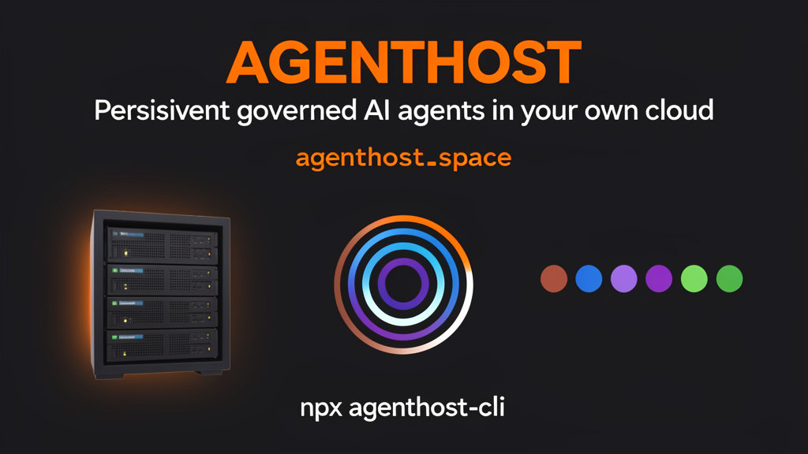

<div align="center">
  
</div>

<br>

<div align="center">

**🧠 0.6.0 — The Brain + Growth Mode (preview)** · **Patent pending: the governance layer** (US provisional 64/122,926) · **🍎 Mac supported**

</div>

<br>

> **Hosting is the mechanism. Continuity is the product.**

One command moves your local AI agent setup to a 24/7 box in **your own** cloud account. Six agent engines — Claude, Codex, Gemini, Kimi, Cursor, and Hermes — coordinate in one shared room. Skills, memory, configs, MCP servers, and your repos come with it. Your phone gets the live session.

```bash
npx agenthost-cli
```

<br>

---

## The Problem

Your AI agents die when your laptop sleeps. Context vanishes. You reopen the laptop, re-explain the task, spend 30 minutes rebuilding context. Every. Single. Day.

IDE agents die with the editor. Platform agents lock you to one model. Custom scripts have no governance. Nobody has built a self-serve, personal persistence-and-governance layer for agent teams — the protocols define how agents talk, not where they live under their operator's own rules.

## The Solution

AgentHost is a self-hosted command center for multi-agent engineering. Five AI engines run 24/7 on a cloud box in your own account, with governance — budget caps, audit trails, approval gates, fail-closed guards. Your agents don't die when your laptop sleeps. You review actions from your phone.

<div align="center">

| 🏛️ | 🏠 | 🔒 | 🔗 |
|:---:|:---:|:---:|:---:|
| **Governance** | **Sovereign Runtime** | **Migration Moat** | **Multi-Box** |
| Budget Caps | Your Cloud | Shared Memory | 5 Engines |
| Audit Trails | Your Rules | Task Board | One Box |
| Approval Gates | Your Secrets | Audit History | Shared Board |
| Fail-Closed Guards | Self-Hosted | Repo Patterns | Per-Task Leader |
| 290+ Proof Tests | No Lock-in | Don't Move | Roadmap |

</div>

---

## What's new in 0.6.0

- **🧠 The Brain.** A persistent shared memory for your whole agent team: every
  engine reads and writes durable, per-agent-keyed memories, with a visual panel
  at `/brain` behind your login. Unconfigured boxes show clearly-labelled demo
  data — never a blank page, never a fake success.
- **📱 Chat survives your phone.** Locking your phone mid-reply no longer kills
  the running agent, discards a finished answer, or wedges the round. Fixed at
  all three layers.
- **🔍 Failures name their own cause.** A skipped engine reports WHY, with the
  actual stderr tail, instead of "run exited 1".
- **📈 Growth Mode — preview.** A switch in Settings (off by default) that turns
  the box toward outward-facing marketing work. The full agency offering is
  separate: [gtmvp.com/growth-mode](https://www.gtmvp.com/growth-mode). Dev Mode
  remains the default and the product.
- **🔗 Causal ordering across machines.** Mesh messages are hash-chained and the
  box refuses any message whose parent it has not recorded — enforcement, not
  bookkeeping. Part of the patent-pending governance layer.
- **🛡️ A regression guard.** The build fails on any NEW test failure instead of
  quietly adding it to the pile.

---

## Features

### 🔄 Persistent

Agents survive lid-close, sleep, reboots. Context, memory, and work state persist across sessions on a persistent volume. Your agents keep working while you're offline — scheduled loops fire on the box, not your laptop.

- 24/7 uptime on your cloud box
- Persistent volume for skills, memory, repos, and audit history
- Scheduled agents (Loops) that work while you sleep
- Web-push notifications when runs or chats finish
- Session resume — pick up exactly where you left off

### 🏛️ Governed

Every action has a budget cap and an audit trail. When one agent tried to merge broken code, another caught it and stopped it. The security boundary is proven, not claimed — a compromised network-facing process provably cannot execute as the agents (verified on production).

- Hard ceilings on tokens, time, and spend per run
- Human approval gates for consequential actions
- Cross-engine review — every PR goes through an independent engine before merge
- Audit trails for every login, run, job, and tool call
- Fail-closed guards — if governance fails, the box stops, it doesn't run unchecked
- 290+ proof tests across 9 security proof suites
- L0–L3 configurable autonomy per engine (Observe → Draft → Propose → Auto)
- The Prime Directive: *"guardrails that manufacture incompetence are defects equal to those that let harm through"*

### 🏠 Sovereign Runtime

Your cloud account. Your keys. Your data. No AgentHost backend. Secrets go from your laptop to the cloud provider's encrypted store — AgentHost is never in the path.

- Deploy to your own cloud (Fly.io, or bring your own)
- Your API keys stay in your cloud provider's encrypted vault
- No AgentHost servers, no telemetry on secret values
- One-command teardown: `agenthost destroy` removes everything
- MIT licensed — read exactly what leaves your machine
- Operator owns root, the control plane, AND the governance

### 📱 Mobile

Monitor, approve, and steer agents from your phone. The box installs as a PWA with touch-optimized keys. No app store, no vendor backend.

- Live chat from your phone — talk to your agents by voice or text
- Approve or deny gated actions from push notifications
- Cookie-based login — no passwords to type
- PWA installable to your home screen
- Works on any phone with a browser

### 🧠 Brain Search

`/brain` greps your skills, memory, and notes across all sessions. Find what your agent learned last week. Bring an Obsidian vault with `--include`.

- Search across all session transcripts
- Skills, memory, and notes indexed
- Obsidian vault integration for shared knowledge
- Agent summarizes findings with citations

### 🔁 Loops

Scheduled agents that work while you sleep. 20 ready-to-configure Loop templates.

- 7am briefings that read your repos and memory
- PR babysitting — watch for changes, review, alert
- Overnight digests
- Cron-like scheduling from your phone
- 20 starter templates included

### 🔑 Secure Credential Handoff

Hand off a token without pasting it into chat. The value is masked, stored in a permission-locked file on your box, and made available to the next Chat or Loop. It never appears in chat history.

- Masked credential storage on your box
- Per-file consent before any .env entry becomes a cloud secret
- GitHub access via fine-grained token scoped to repos you pick
- MCP logins migrate only with explicit opt-in (`--migrate-auth`)
- Optional 2FA on the terminal

### 🔗 Multi-Agent Collaboration

Five AI engines share one persistent thread, task board, review lane, and cost ledger. Each agent has a role: one builds, one reviews, one QA-verifies, one red-teams, one synthesizes.

<div align="center">

| Agent | Role | Status |
|------|------|--------|
| 🔴 **Claude** | Point & Reviewer | ✅ Stable |
| 🔵 **Codex** | Builder & Red Team | ✅ Stable |
| 🔵 **Gemini** | Vision & Second Look | ✅ Stable |
| 🟣 **Kimi K3** | Vision & UX | ✅ Stable |
| 🟢 **Hermes** | QA & Verification | ✅ Stable |

</div>

- Shared task board (Kanban) with cross-engine assignment
- Independent review pipeline — every PR checked by a different engine
- Per-engine token and cost visibility
- 5-stage council pipeline: Architect → Backend → Frontend → Red Team → QA
- Operators can reassign, return, or open any task from their phone

---

## Quick Start

```bash
# 1. Deploy (detects ~/.claude, packs, creates your cloud app, deploys)
npx agenthost-cli

# 2. Open on your phone
agenthost open    # prints a login link

# 3. Manage
agenthost status  # is the box up?
agenthost sync    # push local harness changes
agenthost logs    # tail the box
```

That's it. No AgentHost account, no AgentHost servers. Just your cloud account and your agents.

---

## Pricing

| Tier | Price | What you get |
|------|-------|-------------|
| **Free** | $0 | Full open-source CLI. Your cloud, your ~$11/mo bill. Docs + GitHub issues. |
| **Founding Operator** | $29/mo | Concierge migration. Phone terminal setup. Loops. Brain search. Priority support. Price locked forever. |
| **Founding 50** | $499 lifetime | Everything above, forever. White-glove setup. Use code `TOMORROWSHERE` at checkout. |

Cloud and model usage are always yours. No markup, no bundling.

→ **[Claim a founding seat →](https://agenthost.space/founders/)**

---

## Why Not Just Script Your Cloud Yourself?

You can. The original AgentHost was a script that did exactly that. But you'll end up rebuilding:

- **Harness packing** — detecting `~/.claude`, redacting credentials, disabling localhost MCP servers
- **Volume management** — persistent storage for skills, memory, and repos across redeploys
- **Mobile access** — ttyd + HTTPS + PWA manifest + touch keys
- **Sync workflow** — pushing config and skill changes without a full redeploy
- **Governance layer** — budgets, gates, audit trails, cross-engine review
- **Multi-agent coordination** — shared task board, independent review pipeline

AgentHost is that script, productionized. If you want to build it yourself, the MIT license says go ahead. If you want to ship code instead of infrastructure, `npx agenthost-cli`.

---

## FAQ

**Is this safe? Where do my keys go?**
Your laptop hands them to your cloud provider's CLI. The CLI puts them in your own cloud account's encrypted secret store. Your container reads them there. There is no AgentHost backend to breach.

**What does it cost to run?**
$11 to $12 per month for an always-on box with 2GB of RAM. Your cloud provider bills you directly. Model usage is separate. The CLI itself is free.

**How do I kill it?**
`agenthost destroy`. App, volume, secrets: gone from your account. One command in, one command out.

**What agents are supported?**
Claude Code, Codex, Gemini CLI, Kimi K3, and Hermes Agent are stable. OpenClaw and Ollama are in beta. Any OpenAI-compatible agent can be added.

---

## Links

- **Website:** [agenthost.space](https://agenthost.space)
- **npm:** [agenthost-cli](https://www.npmjs.com/package/agenthost-cli)
- **Founding 50:** [agenthost.space/founders](https://agenthost.space/founders)
- **Interactive Demo:** [agenthost-council-demo.vercel.app](https://agenthost-council-demo.vercel.app)

## License

MIT © Steve Kaplan